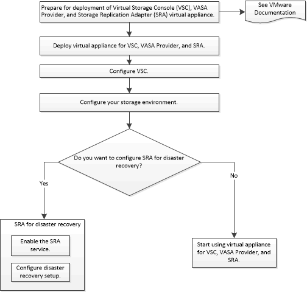

= VSC、VASA Provider及SRA虛擬應用裝置的新使用者部署工作流程
:allow-uri-read: 
:icons: font
:imagesdir: ../media/

[role="lead"]
如果您剛接觸VMware、但從未使用過NetApp VSC產品、則必須先設定vCenter Server並設定ESXi主機、才能部署及設定VSC、VASA Provider及SRA的虛擬應用裝置。

